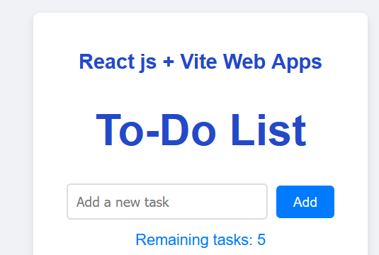
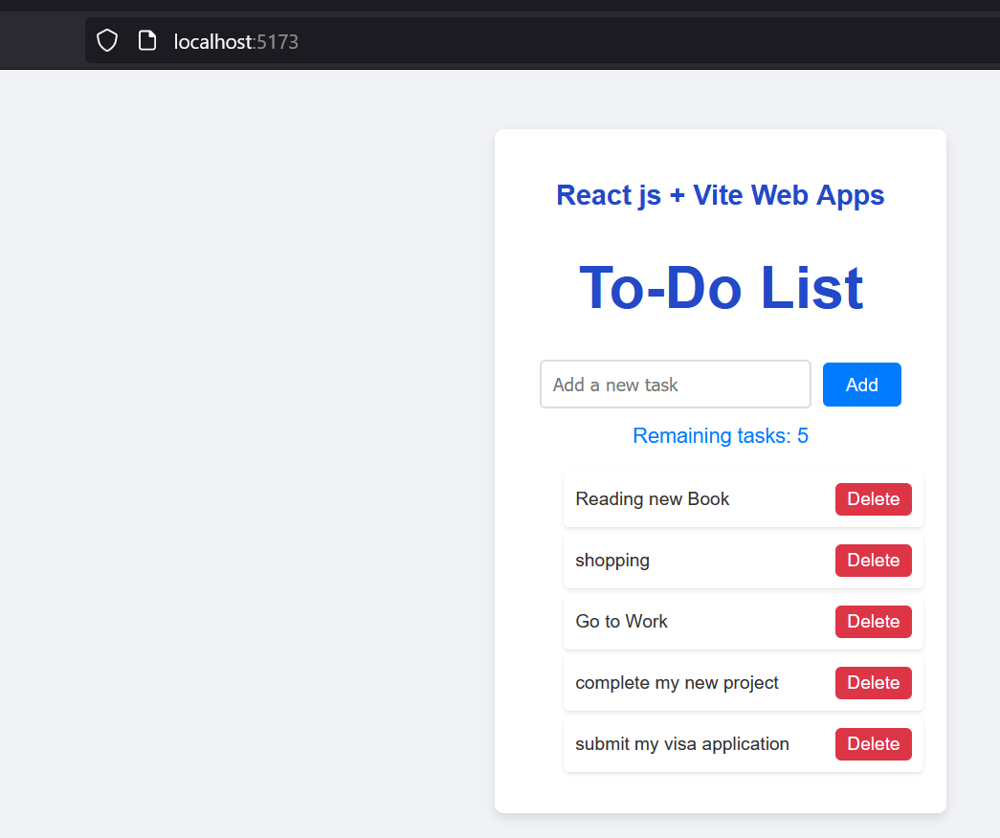

# React + Vite To-Do App
A modern and responsive To-Do application built with React and styled using Tailwind CSS. This app allows users to easily manage their tasks by adding, marking as completed, and deleting items. It features a clean, user-friendly interface with vibrant colors and smooth transitions for an enhanced user experience.
Technologies Used
This template provides a minimal setup to get React working in Vite with HMR and some ESLint rules.

# Main Home screen

# Add Task of items 

    -React: For building the user interface with a component-based architecture.
    -Vite: For fast development and build processes.
    -Tailwind CSS: For utility-first styling to create a visually appealing, responsive design.
    -CSS: Custom styles to enhance the look and feel of the app.

-Features

    -Add, view, and delete tasks
    -Mark tasks as completed
    -Responsive design for various devices

Currently, two official plugins are available:

- [@vitejs/plugin-react](https://github.com/vitejs/vite-plugin-react/blob/main/packages/plugin-react/README.md) uses [Babel](https://babeljs.io/) for Fast Refresh
- [@vitejs/plugin-react-swc](https://github.com/vitejs/vite-plugin-react-swc) uses [SWC](https://swc.rs/) for Fast Refresh
